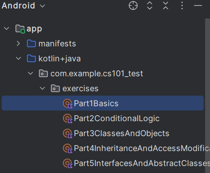
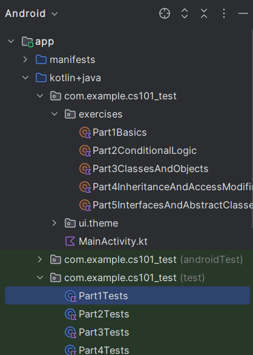
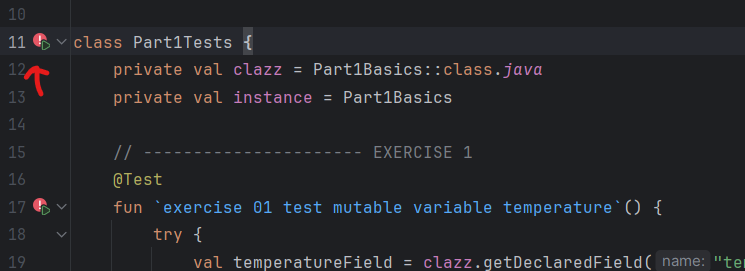
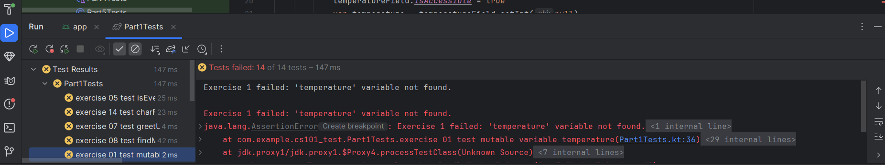

# CS101 Test for Kotlin Jetpack Compose

## Table of Contents
1. [Installation Guide](#installation-guide)
2. [How to check your answers](#how-to-check-your-answers)
   1. [Method 1: Print answers in terminal](#method-1-print-answers-in-terminal)
   2. [Method 2: Run the tests](#method-2-run-the-tests)
3. [Test Overview](#test-overview)
   1. [Part 1: Kotlin Basics Exercises](#part-1-kotlin-basics-exercises)
   2. [Part 2: Conditional Logic Exercises](#part-2-conditional-logic-exercises)
   3. [Part 3: Classes and Objects Exercises](#part-3-classes-and-objects-exercises)
   4. [Part 4: Inheritance and Access Modification Exercises](#part-4-inheritance-and-access-modification-exercises)
   5. [Part 5: Interfaces and Abstract Classes Exercises](#part-5-interfaces-and-abstract-classes-exercises)

## Installation Guide

1. **Fork the GitHub Repository**
   - Go to the repository's GitHub page
   - Click on the "Fork" button at the top right corner of the page

2. **Clone the Repository to Android Studio**
   - Open Android Studio
   - Click "File" -> "New" -> "Project from Version Control"
   - Insert the copied URL from your forked repository and choose the folder to save it in
   - Click "Clone"

3. **Build the Project**
   - Once the project is fully loaded, build it by going to the top bar and selecting "Build" > "Make Project" or pressing `Ctrl+F9` on Windows/Linux (`Cmd+F9` on Mac)
   - Ensure there are no build errors before starting the exercises

4. **Find the exercises**
   - Find the folder "com.example.cs101_test"
   - Inside it open the folder "exercises"
     
     
     
   - Open the exercise part you want
   - Start solving the exercises you want after reading the descriptions

## How to check your answers

There are two methods to check your answers
1. Print your answers in the terminal
2. Run the tests

### Method 1: Print answers in terminal

1. Find the folder "com.example.cs101_test"
2. Open the file "Main.kt"
3. Uncomment the println() for the exercise you want to check
4. Run the main function

### Method 2: Run the tests
1. Find the folder "com.example.cs101_test (test)"
2. Open the file for the part you want to test - e.g. Part1Tests
   
   

3. To the left of the class name inside the file, press "Run 'Part1Tests'" or the name of the test class you have open
   
   

4. In the test results, click on the exercise you want to check and look through the result
   
   

## Test Overview

### Part 1: Kotlin Basics Exercises
- Introduction to Kotlin syntax
- Variables and Data Types
- Basic functions

### Part 2: Conditional Logic Exercises
- If-Else Statements
- Loops
- Functions
- Lambda Functions

### Part 3: Classes and Objects Exercises
- Create and use classes
- Implement methods
- Practice object-oriented concepts

### Part 4: Inheritance and Access Modification Exercises
- Create and extend classes
- Utilize inheritance
- Implement access modifiers

### Part 5: Interfaces and Abstract Classes Exercises
- Define and implement interfaces
- Create abstract classes
- Understand polymorphism (classes based on another class/interface)

